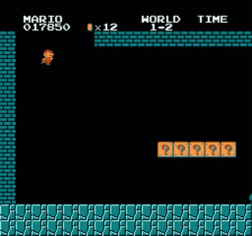
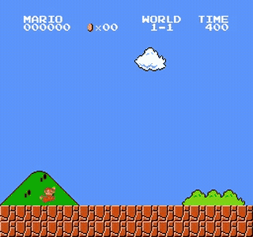

# Mario from a perfect teacher

**Can supervised learning alone — no policy gradient, no value bootstrapping — clear Super
Mario Bros 1-1 by imitating a flawless tool-assisted speedrun? And if not, *where exactly*
does it break?**

This repository is the measured answer. It contains a verified TAS→training-data pipeline, a
behavioural-cloning policy, and — the actual contribution — the controls that decide whether
any of it worked.

[](tests/)


---

## Two clips, and why one of them proves nothing

### Level 1-1, completed from the level start



The policy reaches the flagpole and the game advances to World 1-2 (verified from the HUD in
the final frame, not inferred from a distance number).

This happens on **4 of 200 episodes — 2.0% [0.8%, 5.0%]**. A fixed-rate script that never looks
at the screen completes it **1 of 200 — 0.5% [0.09%, 2.8%]**, Fisher **p = 0.372**, on a single
training seed.

**So the completion is real, and it is not evidence of learned skill.** It is here because it is
the first thing anyone would put in a README, and because the control that empties it of meaning
is the point of the project.

### The Koopas — where learning genuinely wins



Past the Koopas at x=1248. Against a **run-length script matched on the policy's own token
marginals** — identical action representation, but blind — the policy is
**+5.5 pp, 10 of 10 paired seeds, p = 0.0020**, at the design floor and surviving Bonferroni
correction across a four-region family. Mean A-hold of 6.6–8.3 frames rules out the
"long holds are just improbable under i.i.d. sampling" objection.

**The mechanism was specified before the result: the Koopas move.** Screen-conditioning has to
pay where the obstacle moves, and a fixed token distribution cannot compete there. The early
obstacles are static geometry, which a blind baseline handles without seeing anything.

> **These are honest takes, not re-enactments.** A named episode cannot be re-filmed: SMB's
> pseudo-random state advances with total frames elapsed and survives a level restart, so an
> episode's outcome depends on the session's entire history. 200 episodes were filmed live and
> the takes matching each claim were kept. Full provenance in [`gifs/manifest.json`](gifs/manifest.json).

---

## The result

### The negative, with its mechanism

**The training corpus is 1,223,797 frames containing zero deaths and zero recoveries.**

A perfect teacher never fails, so the data contains no example of getting out of trouble. The
policy therefore never observes a recovery, and the moment it leaves the expert's state
distribution it has nothing to imitate.

The signature of this is visible in training: **cross-entropy falls monotonically 4.033 → 1.228
while play degrades**, and live performance peaks at **1,000 steps — 0.82 epochs**. Optimising
the imitation objective past that point makes the policy worse at the task.

Measured directly: **imitation fidelity and task performance are uncorrelated, r = −0.04.**
Copying the expert more accurately does not make the policy play better.

### Where it fails is positional, not gradual

720 episodes launched from 72 saved start positions across two independently trained networks:
**the policy stops at the same absolute positions no matter where it starts.** 650 pixels of
head start buys about 130 pixels of extra progress.

| started at x | median furthest x (net A) | (net B) |
|---|---|---|
| 0–200 | 701 | 723 |
| 200–350 | 716 | 722 |
| 350–500 | 707 | 722 |
| 500–650 | 819 | 864 |

Failures cluster at five named locations — pipe 3's face (720), pipe 4's face (912), the first
Goomba (288), the Koopas (1216–1248), and a fall (1504–1536) — not along a continuum. It does
not run out of competence; it arrives in good shape and fails at specific addresses.

### Eight intervention families, closed by measurement

Observation · read-out · capacity · resolution · generation rule · corpus composition ·
objective · search-and-distil.

**This is not a failure to see, to read, to represent, to sample, or to search.** All five were
measured. Up-weighting exactly the frames where the policy fails makes it *worse* (−4.0 pp,
0 of 10 seeds) — at a failure window the expert is executing flawless play from a state the
policy never occupies, which makes those frames the least transferable data in the corpus.

### Two findings about the data itself

- **The best demonstrations are not the best teachers.** Older, slower, less-optimised
  speedruns train a policy ~3× better than world records at matched data volume.
- **A quarter of the data beats all of it.** ([`data/plots/scaling_curve.png`](data/plots/scaling_curve.png))

Both point the same way: **curate, do not accumulate.**

---

## Claims withdrawn

Eight, each replaced by what the re-measurement showed:
`+80 pp` · `+6.3 pp` · "the head is the bottleneck" · "Down is the route" · "no timing
anywhere" · "the encoder collapses seed spread" · `8.9%` · the 7-wall Bonferroni family.

The largest was a statistics error made twice: an interval pooled *episodes* as the independent
unit when the two arms differed **by training seed**. Recomputed with the seed as the unit and an
exact permutation test, a "+13 pp encoder improvement" became 12.1 pp at **p = 0.175** — where
the smallest attainable p was 0.008, so the test had the power to find a separation and did not.

Full history, including the wrong turns, in [`docs/RESEARCH_LOG.md`](docs/RESEARCH_LOG.md).

## Seven measurement defects, and the one defence that caught them

Every one ran to completion, produced plausible numbers, and raised no error. None would have
been caught by a test asking "did it crash."

| defect | what it would have produced |
|---|---|
| stall terminator censoring reach | every reach figure understated |
| area-union bug | invented a bonus-area route |
| 11-state probe | inverted a conclusion |
| pipe-3 sweep | an action space that excluded the answer |
| local `STALL` copies | a 35-point discrepancy |
| frames-vs-samples confusion | a mis-scaled corpus |
| degenerate Bonferroni family | a correction that corrected nothing |

**What caught them was the same thing every time: cross-checking one measurement against an
*independent* measurement of the same quantity, then investigating the disagreement instead of
keeping the more convenient number.** That is the transferable finding.

---

## How it works

| Stage | Module | What it does |
|---|---|---|
| 1. Parse | `tasdata/fm2.py`, `tasdata/bk2.py` | FCEUX `.fm2` / BizHawk `.bk2` → `(n_frames, n_buttons)` bool array |
| 2. Replay | `tasdata/fceux_backend.py` | Deterministic replay; captures 84×84 grayscale frames + RAM trace |
| 3. Verify | `tasdata/verify.py` | Pass/fail per run, with the frame where it diverged |
| 4. Clone | `tasdata/bc/` | Behavioural cloning + live evaluation against scripted baselines |

Verified end to end: `SYNC: PASS`, all 32 levels 1-1 → 8-4, 67,117 frames.

**Policy:** 84×84 × 4-frame stack → CNN(32,64,64) → 1-layer transformer, `d_model=64` → linear
head. 325,964 parameters. Plain cross-entropy, 1,000 steps, batch 64, lr 3e-4, capped run-length
sampling at temperature 0.7.

## Repository layout

**One experiment, one script, one artifact.** `scripts/<name>.py` writes `data/<name>.json` —
83 of the 107 experiment scripts pair with a same-named result file. Every number quoted above
traces to one of them, and [`data/README.md`](data/README.md) indexes them by the claim they
support.

```
tasdata/     the package — parse, replay, verify, clone   (46 files)
tests/       324 tests, ~10s, no ROM required             (14 files)
scripts/     one per experiment                          (107 files)
data/        one artifact per experiment                 (157 files)
docs/        research log + the superseded findings doc
gifs/        the two clips, with provenance in manifest.json
```

Nothing here was computed in a notebook or by hand.

## Reproducing

**You must supply your own legally-obtained ROM.** No ROM is distributed here.
Place an NTSC Super Mario Bros dump at `smb.nes`; the pipeline verifies
`md5(prg+chr) = 8e3630186e35d477231bf8fd50e54cdd` and refuses mismatches, because a hash
mismatch makes every SMB TAS die inside 1-1.

```bash
conda env create -f environment.yml && conda activate tas   # Python 3.11; numpy<2 is load-bearing
pytest                                                       # 324 tests, ~10s, no ROM needed
tasdata batch --plan data/shortlist.json                     # regenerate the ~11 GB capture set
```

Captured run data is not committed (regenerable). Requires FCEUX 2.6.6 and a real window —
headless Qt platforms segfault.

## Related work

Neural networks have played Mario since MarI/O (2015), and `gym-super-mario-bros` exists
because reinforcement learning on this game is well-trodden. **This project asks a different
question.** RL agents explore and receive reward; this policy only ever sees demonstrations and
cannot discover anything the teacher did not do. The comparison of interest is therefore not
against an RL agent but against *scripted baselines that also cannot learn* — which is why the
three-button script and the representation-matched run-length script are the controls throughout.

## Credits

TAS movies are the work of their authors and are used as input data, not claimed as part of this
work — in particular **happylee**, whose `happylee_mars608-smb-warpless.fm2` (TASVideos
publication 3728) is the primary training run. Provenance for every movie is in
`data/movies/README.md`.

## Status

The full assembled result document (`data/RESULT.md`) is in progress. Everything stated above is
current as of block 66 and is drawn from [`docs/RESEARCH_LOG.md`](docs/RESEARCH_LOG.md) and
[`gifs/manifest.json`](gifs/manifest.json). [`docs/FINDINGS_2026-08-04.md`](docs/FINDINGS_2026-08-04.md)
is archived and superseded — it is kept for provenance, not as a current claim.

## License

Apache 2.0 — code only. TAS movie files belong to their respective authors.
